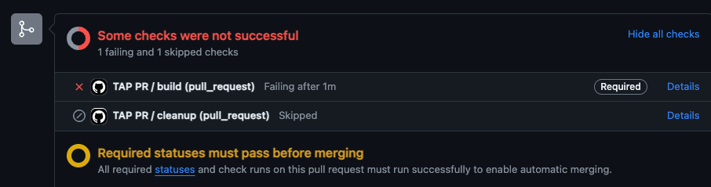

# tap-workload-pr-action

The purpose of this repo is to show an example of configuring a TAP workload to run a pull-request supply chain.

Why?

Showcase a pull-request workflow to enable the same build + test flow that runs on a merge to main would pass within a pull request prior to merging.

The example here will run the tests and build an image. Future examples can build upon this simple supply chain to add integration testing or other steps prior to passing.

# setup

## code repo

### kubeconfig env variable

Need to add an env variable called KUBE_CONFIG that holds a base64 encoded string of the kubeconfig to use for connecting to the dev cluster that will process the supply chain.

### workload template

Template that is read in and used by the action is located at [config/pr-workload-template.yaml](config/pr-workload-template.yaml)

The action will read this in and then substitute variables from the pull-request using ytt prior to submitting it to the cluster for processing.

The workload yaml is going to be unique to your workload and contain requires variables to allow it to build successfully. For this sample, the key bit from a supply chain point of view is the label `apps.tanzu.vmware.com/pull-request: "true"`

### GitHub action file

The sample is located at [.github/workflows/tap-pr.yml](.github/workflows/tap-pr.yml)

If you are okay with the opinions taken, the only thing you need to change in the actions file is the namespace to deploy the workload into, which you would find toward the top of the file
```yaml
env:
  WORKLOAD_NAMESPACE: demos
```

## build cluster

### pull-request supply chain installation

For this example, we want a supply chain to test and build an image of our commit to verify correctness prior to allowing a merge.

Located at [config/pull-request-supply-chain.yaml](config%2Fpull-request-supply-chain.yaml) is an example you can install (developed against on TAP 1.7) 


# pull request in action

## when will it run

The action is configured to run on
```yaml
on:
  pull_request:
    types: [opened, reopened, synchronize, closed]
```
Open/ReOpen/Synchronize will submit a new workload using the commit that triggered the action.

Closed will clean up all workloads created related to the pull request using the convention of `workloadname-pr-PR_NUMBER`

# successful run

On a pull request open, the action will create and submit the workload. Here is a snippet from the action run 


Snipped from the cluster
```shell
(⎈|tap-full:demos)➜  tap-workload-pr-action git:(addPrWorkflow) ✗ k get workloads
NAME                                  SOURCE                                              SUPPLYCHAIN    READY     REASON               AGE
tap-workload-pr-action-pr-1-608386e   https://github.com/rabeyta/tap-workload-pr-action   pull-request   Unknown   MissingValueAtPath   53s
```

Once submitted, the action will check the status of the test job until timeout. 


After the tester, it will confirm the image was successfully built.


Once all are completed, the action shows green and your pull-request could be merged.


from the cluster
```shell
(⎈|tap-full:demos)➜  tap-workload-pr-action git:(addPrWorkflow) ✗ k get workloads
NAME                                  SOURCE                                              SUPPLYCHAIN    READY   REASON   AGE
tap-workload-pr-action-pr-1-608386e   https://github.com/rabeyta/tap-workload-pr-action   pull-request   True    Ready    7m4s
```

```shell
(⎈|tap-full:demos)➜  tap-workload-pr-action git:(addPrWorkflow) ✗ k get po
NAME                                                    READY   STATUS      RESTARTS   AGE
tap-workload-pr-action-pr-1-608386e-build-1-build-pod   0/1     Completed   0          7m30s
tap-workload-pr-action-pr-1-608386e-jps76-test-pod      0/1     Completed   0          7m23s
```

from the developer portal


# failed test

When a test fails, you will be able to see that on the cluster, within the developer portal and on the GitHub pull request page.

Developer Portal


On the cluster through the Tanzu CLI
```shell
(⎈|arobert-full:demos)➜  tap-workload-pr-action git:(addPrWorkflow) ✗ tanzu apps workload get tap-workload-pr-action-pr-1-991a3c4
📡 Overview
   name:        tap-workload-pr-action-pr-1-991a3c4
   type:        web
   namespace:   demos

💾 Source
   type:     git
   url:      https://github.com/rabeyta/tap-workload-pr-action
   commit:   991a3c40161b5b0f8fe5f07c2af1ae2700c38d33

📦 Supply Chain
   name:   pull-request

   NAME              READY   HEALTHY   UPDATED   RESOURCE
   source-provider   True    True      7m52s     gitrepositories.source.toolkit.fluxcd.io/tap-workload-pr-action-pr-1-991a3c4
   source-tester     False   False     6m49s     runnables.carto.run/tap-workload-pr-action-pr-1-991a3c4
   image-provider    True    True      6m20s     images.kpack.io/tap-workload-pr-action-pr-1-991a3c4

🚚 Delivery

   Delivery resources not found.

💬 Messages
   Workload [HealthyConditionRule]:   Tasks Completed: 1 (Failed: 1, Cancelled 0), Skipped: 0

🛶 Pods
   NAME                                                    READY   STATUS      RESTARTS   AGE
   tap-workload-pr-action-pr-1-991a3c4-4lws6-test-pod      0/1     Error       0          7m44s
   tap-workload-pr-action-pr-1-991a3c4-build-1-build-pod   0/1     Completed   0          7m52s

To see logs: "tanzu apps workload tail tap-workload-pr-action-pr-1-991a3c4 --timestamp --since 1h"
```

On the pull request




# multiple commits to the pull request

Each commit will submit a new workload, as can be seen here on the developer portal and cluster. You can see passing commits and failed commits. 


Cluster
```shell
(⎈|tap-full:demos)➜  tap-workload-pr-action git:(addPrWorkflow) ✗ k get workloads
NAME                                  SOURCE                                              SUPPLYCHAIN    READY   REASON                 AGE
tap-workload-pr-action-pr-1-608386e   https://github.com/rabeyta/tap-workload-pr-action   pull-request   True    Ready                  23m
tap-workload-pr-action-pr-1-991a3c4   https://github.com/rabeyta/tap-workload-pr-action   pull-request   False   HealthyConditionRule   14m
```

# pull request close

On close of the pull request or merging, the action will delete all workloads related to the pull request.

